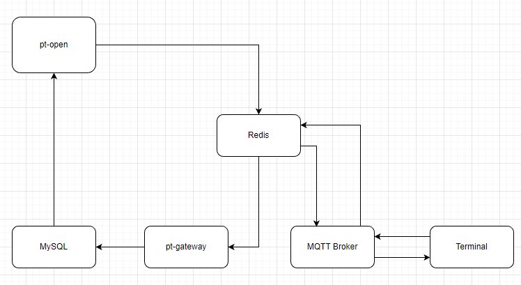

# 设备控制链路监控
* 状态: 提议中
* 决策者
  * 黄雪华
  * 吴展威
  * 陈孟轩
* 日期: 2023-03-09

# 背景与问题陈述
## 需求
需要监控平台，定时下发指令，检查设备的控制链路是否正常。

## 流程
#### 下行链路
1. pt-open把指令发到Redis的队列中
1. MQTT-broker从Redis中取出报文
1. MQTT-broker把报文发送给设备
#### 上行链路
1. Terminal发送报文至MQTT-Broker
1. MQTT-Broker把报文发送到Redis的队列中
1. pt-gateway读取redis队列中的报文
1. pt-gateway把对应报文写入MySQL数据库
1. pt-open轮询MySQL数据库，获取回复的报文

# 决策驱动因素
* 实现难度
* 是否能贴切的反映控制链路的情况

# 考虑方案

## 方案1
沿用安装小程序的调用链路。

#### 流程
* 客户端请求pt-open原有http api发送CMD指令
* MQTT-Broker在TOPIC为S{SN}，下发0xFF号报文，参数CMD设置为PING
* 设备在TOPIC为C，回复0xFE号报文
* 客户端请求pt-open原有http api获取CMD指令结果
#### 优点
* 客户端从安装小程序变成监控平台，最能反映链路是否正常
* 只要把http api接口开放即可，修改最小
#### 缺点
* 定时下发CMD指令(PING)，会导致冲掉其它客户端对终端进行的CMD指令。

## 方案2
pt-open新增接口，发送其它类型报文
#### 流程
* 客户端请求pt-open新增http api发送PING指令
* MQTT-Broker在TOPIC为S{SN}，下发0x02号报文，要求终端上报PING报文
* 设备在TOPIC为C，回复PING报文
* 客户端请求pt-open新增http api获取PING指令结果
#### 优点
* 解决了方案1，CMD冲突的问题
#### 缺点
* 要重新开发http api
* 与设备交互，上下行要使用不同的协议报文
* 要更新终端与MQTT-Broker的协议
* 链路与原来的控制链路差距较大

# 决策结果
## 正面后果
...
## 负面后果
...

# 参考
> iV100终端与平台通信协议v6.1.0(草稿).pdf